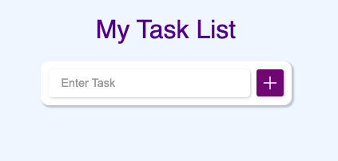
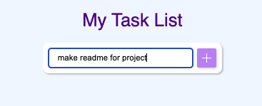
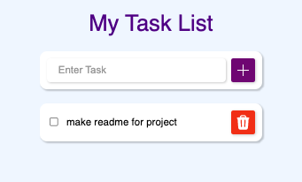
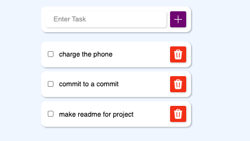
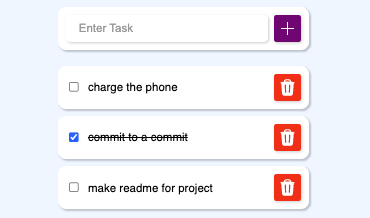
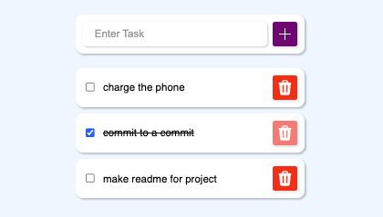
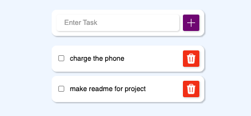

#TODO APP

This project I learn how to make a todo app where you can add multiple tasks via an input field, mark them as complete and delete them.

This is the input field. Once you've writtin your task, you can press the button or press enter. Both methods work for submitting the task.

Here's how the task displays once it is submitted. The delete icon is imported from @heroIcons.

You can add multiple tasks. There is a filter that makes the most recent task appear at the top.

You can mark the task as complete by either clicking on the task or checking the input box.

Also, you can delete a task by clicking the delete icon of the respective task. 

---

## Skills used & learned

- event handlers: onClick, onSubmit, onInput
- React hooks: useState( )
- heroIcons icon library
- using props: 
  - passing data, functions & state. 
  - Prop drilling
- methods:
  - map( )
  - filter( )
  - sort( )
- creating a unique id using: id: Date.now()
- component files
- CSS:   .className:checked{text-decoration: line-through};

